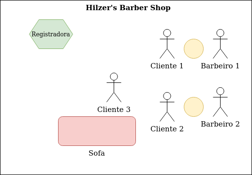
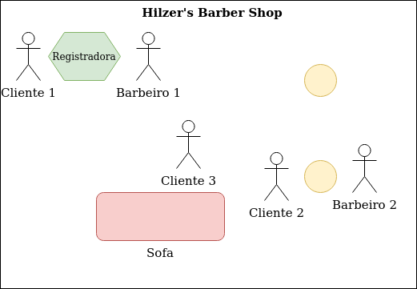
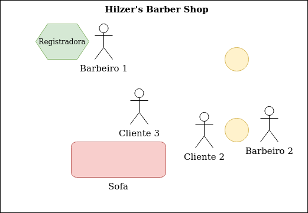
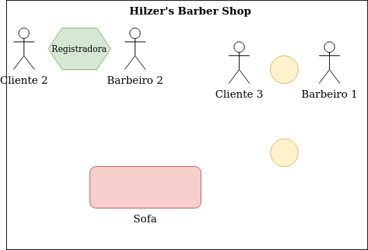

## Hilzers Barbershop Problem


#### Problema em questão
> Our barbershop has three chairs, three barbers, and a waiting area that can accommodate four customers on a sofa and that has standing room for additional customers. Fire codes limit the total number of customers in the shop to 20.
>
> A customer will not enter the shop if it is filled to capacity with other customers. Once inside, the customer takes a seat on the sofa or stands if the sofa is filled. When a barber is free, the customer that has been on the sofa the longest is served and, if there are any standing customers, the one that has been in the shop the longest takes a seat on the sofa. When a customer’s haircut is finished, any barber can accept payment, but because there is only one cash register, payment is accepted for one customer at a time. The bar- bers divide their time among cutting hair, accepting payment, and sleeping in their chair waiting for a customer.

### Exemplo

No exemplo abaixo, temos uma versão simplificada, feita para exemplificação, do Hilzer's Barbershop Problem onde 2 barbeiros, cada um com uma cadeira, cortam o cabelo de 2 clientes numa barbearia com um sofá de 2 lugares.

Na Figura 1.1, dois clientes esperam no sofá e um espera em pé.

Na Figura 1.2, os dois barbeiros são liberados e os dois clientes sentados no sofá (FIFO) são liberados por meio do semáforo a sentar na cadeira de cada barbeiro. O cliente 3 também sai da sua fila e senta no sofá, liberado pelo semáforo do sofá.

Na Figura 1.3, o cliente 1 vai pagar e o barbeiro vai receber o dinheiro. O cliente 3 fica pronto.

Na Figura 1.4, o processo cliente 1 termina (Cliente faz o pagamento, barbeiro emite o recibo) e o barbeiro volta para sua cadeira, permitindo que ele atenda o cliente 3.










#### Breaking Down the Problem:

##### Entidades:
- Slots:
- 3 on barber chair's
- 4 on sofa
- 13 standing

##### Actions:
- Customers will sit on the sofa until it is filled, if filled, they stand (FIFO)
- The customer on the sofa for the longest time will be served first (FIFO)
- After the haircut, one customer at a time pays for it (Only one cash register), any barber can receive payments

##### Fluxo dos clientes:
```py
entrarNaLoja()
sentarNoSofa()
cortarCabelo()
sentarCadeiraBarbeiro()
pagar()
```

##### Fluxo dos barbeiros:
```py
cortarCabelo()
emitirRecibo()
```

#### Estruturas Necessárias:
Controle de fluxo:
```c
// Control
sem_t barberChairSemaphore; // start value @ 3
sem_t sofaSemaphore; // start value @ 4
// sem_t shopSemaphore; // start value @ 20 -> not used because clients don't wait

sem_t cashSemaphore; // start value @ 0
sem_t receiptSemaphore; // start value @ 0

sem_t barberReadySemaphore; // start value @ 3
sem_t customerReadySemaphore; // start value @ 0

pthread_mutex_t barberCashRegisterMutex;

Queue qRegistradora;
pthread_mutex_t mutexRegistradora;

Queue qSofa;
pthread_mutex_t mutexSofa;

Queue qEmPe;
pthread_mutex_t mutexEmPe;
```

### Sobre as Estruturas de Controle
A maioria das estruturas de controle utilizadas são filas. Já que todo o probelma
segue o comportamenteo FiFo. A única excessão é dos cortes de cabelos, que podem
ter durações variadas e ocorrem assincronamente, portanto não faz sentido pensar
em uma fila.

Por conta de como o problema funciona, foram criadas 3 filas. Cada uma com seu devido Mutex para evitar condições de corrida nos ponteiros:
```c
Queue qRegistradora;
pthread_mutex_t mutexRegistradora;

Queue qSofa;
pthread_mutex_t mutexSofa;

Queue qEmPe;
pthread_mutex_t mutexEmPe;
```
Ou seja, os mutex funcionam para controlar a leitura e escrita às filas. Isso
acontece **sempre**, portanto não será representado nos pseudo-códigos a seguir.


### Fluxo do Cliente

A jornada do cliente se inicia fora da barbearia, ao chegar na porta, caso existam
mais de 20 clientes dentro da mesma, ele entra.
```py
if qEmPe.count >= N_MAX_EM_PE:
    entrarNaLoja()
    qEmPe.enqueue(custID);
```

Ao entrar, o "pede passagem" ao semáforo do sofá e caso consiga, sai da fila de
"em pé" e vai para a de "sentados no sofá".
```py
sem_wait(sofaSemaphore);

qEmPe.dequeue()

qSofa.enqueue(custID)
sentarNoSofa()
```

Sentado no sofá, segue o mesmo procedimento, porém para sentar em uma das cadeiras
do barbeiro. Como pode sentar em qualquer cadeira, aqui não utiliza-se uma queue.

```py
sem_wait(barberChairSemaphore)

qSofa.dequeue(qSofa)
sentarCadeiraBarbeiro(custID)

sem_post(sofaSemaphore)
```

A ação "sentar na cadeira" sinaliza que está esperando um corte (por meio de semáforos)
e um barbeiro disponível atende o cliente. O cliente "espera a confirmação" do barbeiro
que irá realizar seu corte com a utilização de 2 semáforos.

```py
sem_wait(barberReadySemaphore)
sem_post(customerReadySemaphore)
recebendoCorteCabelo(custID)
```

Em seguida, o cliente realiza o pagamento e espera pelo recibo emitido pelo barbeiro:

```c
sem_post(cashSemaphore)
pagar(custID)
sem_wait(receiptSemaphore)
```

### Fluxo do Barbeiro

Ao iniciar a _thread_ do barbeiro, o barbeiro fica oscioso esperando um cliente "chamá-lo"
(por meio dos 2 semáforos do caso anterior). Quando isso ocorre, ele corta o cabelo do cliente.
Depois dá _post_ na cadeira que o cliente travou.

```py
sem_post(&barberReadySemaphore)
sem_wait(&customerReadySemaphore)

cortarCabelo(barberID)
sem_post(&barberChairSemaphore)
```

Para a caixa-registradora, voltamos a ter uma fila. Quando um cliente vai para a
caixa registradora, um barbeiro recebe o pagamento e emite uma nota fiscal, que
é esperada (_awaited_) pelo cliente antes que o mesmo possa ir embora.

```py
sem_wait(&cashSemaphore)

emitirRecibo(barberID)

sem_post(&receiptSemaphore)
```

A thread do barbeiro segue em loop infinito. Ela é finalizada quando a função _main_
finaliza sua execução.


#### Função _main_

A função _main_ é bem simples. Trata apenas de inicializar e destruir os semaforos
e mutexes, e spawnar as threads.

```py
def main(CLIENT_AMMOUNT):
    semaphores_init(semaphore_list)
    mutexes_init(mutex_list)

    # barbeiros são iniciados antes pq já estão na loja quando os clientes chegam
    for i in range(N_BARBERS):
        spawn_thread(barberRoutine, barberID)

    for i in range(CLIENT_AMMOUNT):
        sleep(rand() % 2)
        spawn_thread(clientRoutine, clientID)


    semaphores_destroy(semaphore_list)
    mutexes_destroy(mutex_list)
```

A utilização do programa segue como:
```sh
cd "OS-Assignments/Hilzer's Barbershop Problem"
make
./main.out 42 # spawna 42 clientes para aquele dia
```
